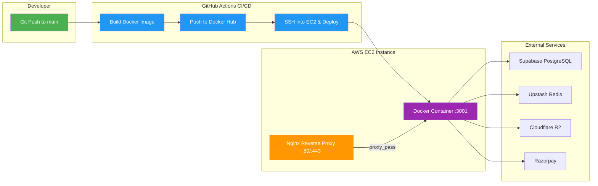
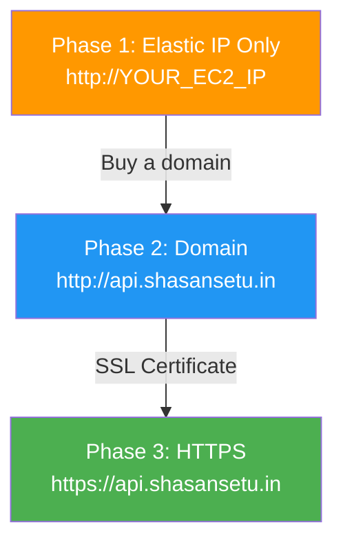
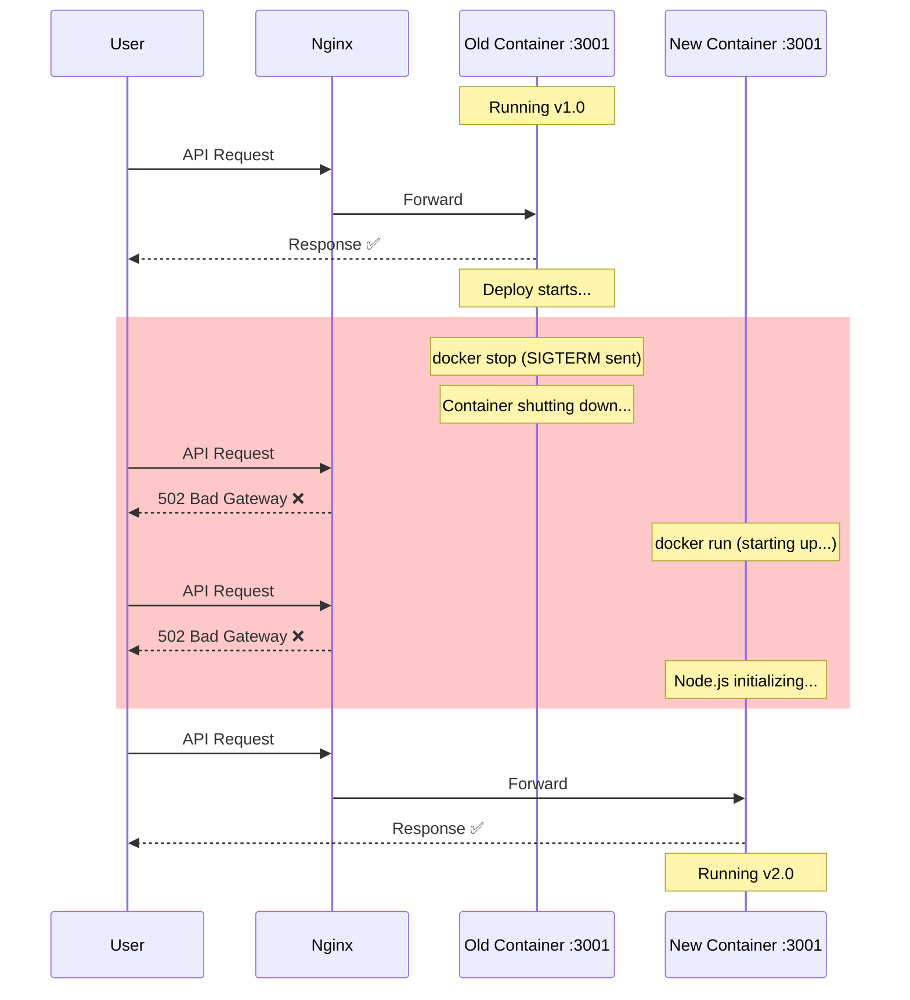
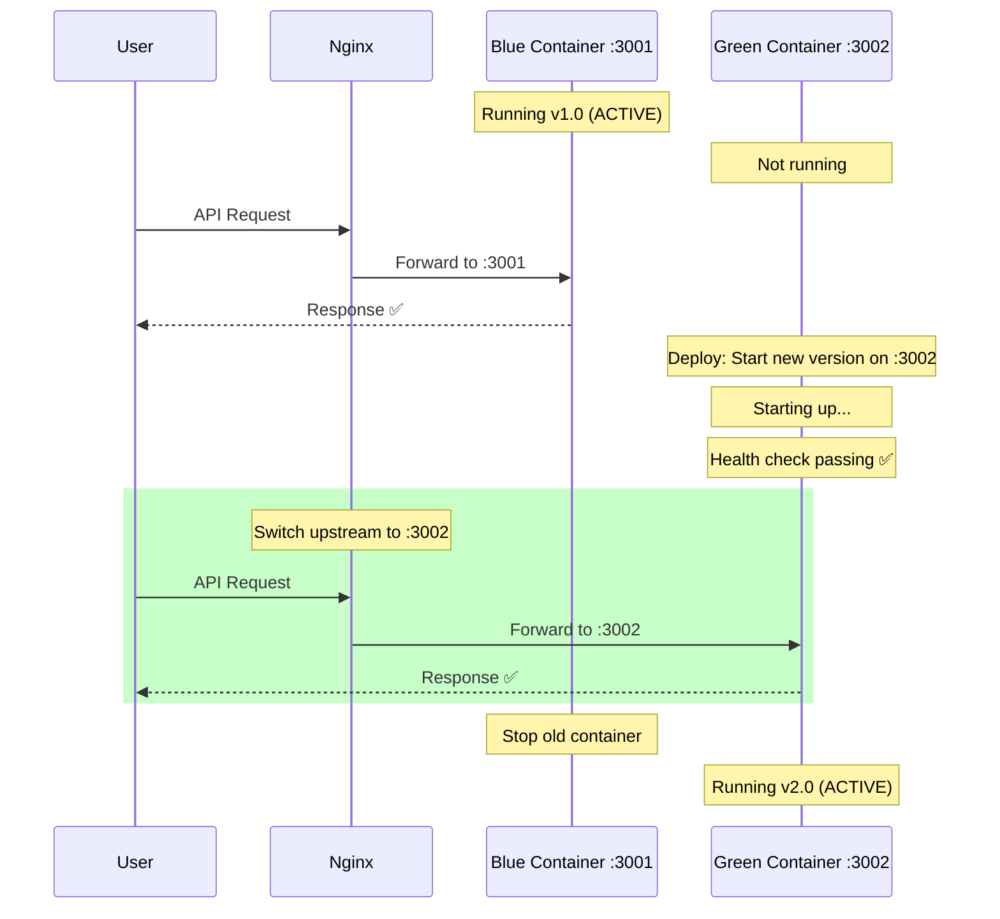

# ShasanSeva Backend — AWS EC2 Deployment & CI/CD Guide

> **Moving from Render → AWS EC2 with Docker + GitHub Actions**

---

## Architecture Overview



### The Flow in Plain English

1. You push code to `main` branch on GitHub
2. GitHub Actions automatically builds a Docker image of your API
3. The image is pushed to Docker Hub (a public/private registry to store images)
4. GitHub Actions SSHes into your EC2 and pulls the new image
5. The old container is stopped, a new one starts with the fresh image
6. Nginx (running on EC2) forwards incoming HTTP/HTTPS requests to the Docker container
7. Your API talks to Supabase, Redis, R2, Razorpay — all external, nothing to manage on EC2

---

## Table of Contents

1. [Part 1: Provision the EC2 Instance](#part-1-provision-the-ec2-instance)
2. [Part 2: Initial Server Setup](#part-2-initial-server-setup)
3. [Part 3: Dockerfile for the Monorepo](#part-3-dockerfile-for-the-monorepo)
4. [Part 4: Nginx Reverse Proxy](#part-4-nginx-reverse-proxy)
5. [Part 5: Environment Variables & Secrets](#part-5-environment-variables--secrets)
6. [Part 6: GitHub Actions CI/CD Pipeline](#part-6-github-actions-cicd-pipeline)
7. [Part 7: Domain & SSL (HTTPS)](#part-7-domain--ssl-https)
8. [Part 8: Zero-Downtime Deployments](#part-8-zero-downtime-deployments)
9. [Appendix: Useful Commands Cheat Sheet](#appendix-useful-commands-cheat-sheet)

---

## Part 1: Provision the EC2 Instance

> **WHY:** EC2 is the virtual machine where your API will run. Think of it as renting a computer in Amazon's data center. Unlike Render (which abstracts everything away), EC2 gives you full control over the server — OS, networking, scaling, costs.

### Step 1.1: Log into AWS Console

1. Go to [AWS Console](https://console.aws.amazon.com/)
2. Sign in (create an account if you don't have one — you get 12 months free tier)
3. Select a **region** close to your users. For India: **`ap-south-1` (Mumbai)**

> **WHY Mumbai?** Your users are in India. Lower latency = faster API responses. Your Supabase DB should ideally be in the same or nearby region.

### Step 1.2: Launch an EC2 Instance

1. Search for **EC2** in the AWS console → Click **Launch Instance**

2. **Name:** `shasansetu-api`

3. **AMI (Operating System):** Select **Ubuntu Server 24.04 LTS (HVM), SSD Volume Type**
   > **WHY Ubuntu 24.04?** It's the most widely supported Linux distro. Most Docker/Node.js guides target Ubuntu. LTS means 5 years of security updates.

4. **Instance Type:**

   | Stage | Instance | vCPU | RAM | Cost (Mumbai) |
   |-------|----------|------|-----|---------------|
   | Testing/Dev | `t2.micro` | 1 | 1 GB | Free tier eligible |
   | Production | `t3.small` | 2 | 2 GB | ~$15/month |
   | Scale | `t3.medium` | 2 | 4 GB | ~$30/month |

   > **WHY t2.micro to start?** Free tier eligible for 12 months. Good enough to test the setup. Switch to t3.small before production launch.

5. **Key Pair:** Click **Create new key pair**
   - Name: `shasansetu-api-key`
   - Type: RSA
   - Format: `.pem`
   - **Download and save this file securely** — you need it to SSH into the server. **You cannot download it again.**

   > **WHY a key pair?** This is how you securely connect to your server via SSH instead of passwords. It's like a physical key to your server — lose it, and you're locked out.

6. **Network Settings → Security Group:** Create a new security group with these rules:

   | Type | Port | Source | Why |
   |------|------|--------|-----|
   | SSH | 22 | My IP (or `0.0.0.0/0` if IP changes) | To connect to the server |
   | HTTP | 80 | `0.0.0.0/0` (Anywhere) | For web traffic |
   | HTTPS | 443 | `0.0.0.0/0` (Anywhere) | For secure web traffic |
   | Custom TCP | 3001 | `0.0.0.0/0` (Anywhere) | Direct API access (temporary, remove after Nginx setup) |

   > **WHY these ports?** Port 22 = SSH access for you. Ports 80/443 = for Nginx to serve HTTP/HTTPS. Port 3001 = direct API access for initial testing (you'll remove this later when Nginx is handling traffic).

7. **Storage:** 20 GB gp3 (default is 8 GB — increase to 20 GB for Docker images and logs)

   > **WHY 20 GB?** Docker images, build artifacts, and logs add up. 8 GB will fill up fast. 20 GB is safe and still cheap (~$1.60/month).

8. Click **Launch Instance**

### Step 1.3: Allocate an Elastic IP

> **WHY?** By default, your EC2 instance gets a new public IP every time it restarts. An Elastic IP is a **static IP** that stays the same. Your frontend, GitHub Actions, and DNS all need a consistent address.

1. Go to **EC2 → Elastic IPs → Allocate Elastic IP address**
2. Click **Allocate**
3. Select the new IP → **Actions → Associate Elastic IP address**
4. Choose your `shasansetu-api` instance → **Associate**

> **Save this IP** — this is your API's permanent address. Let's call it `YOUR_EC2_IP`.

> [!IMPORTANT]
> An Elastic IP is **free** as long as it's attached to a **running** instance. If you stop the instance but keep the IP, AWS charges ~$3.65/month. Always release unused Elastic IPs.

---

## Part 2: Initial Server Setup

> **WHY:** Your fresh EC2 instance is a blank Ubuntu machine. You need to install Docker (to run your containerized API), Nginx (to handle HTTPS and forward traffic), and configure basic security.

### Step 2.1: Connect to Your EC2

```bash
# On your local machine (Windows PowerShell or Git Bash)
# First, navigate to where you saved the .pem key file

ssh -i "shasansetu-api-key.pem" ubuntu@YOUR_EC2_IP
```

> **WHY `ubuntu@`?** Ubuntu AMIs use `ubuntu` as the default username. The `-i` flag tells SSH to use your key file for authentication instead of a password.

If you get a permissions error on the `.pem` file:
```powershell
# Windows PowerShell — fix permissions
icacls "shasansetu-api-key.pem" /inheritance:r /grant:r "$($env:USERNAME):(R)"
```

### Step 2.2: Update System Packages

```bash
sudo apt update && sudo apt upgrade -y
```

> **WHY?** Fresh AMIs can have outdated packages with known security vulnerabilities. Always update first.

### Step 2.3: Install Docker

```bash
# Install Docker's official GPG key and repository
sudo apt install -y ca-certificates curl
sudo install -m 0755 -d /etc/apt/keyrings
sudo curl -fsSL https://download.docker.com/linux/ubuntu/gpg -o /etc/apt/keyrings/docker.asc
sudo chmod a+r /etc/apt/keyrings/docker.asc

echo \
  "deb [arch=$(dpkg --print-architecture) signed-by=/etc/apt/keyrings/docker.asc] https://download.docker.com/linux/ubuntu \
  $(. /etc/os-release && echo "${VERSION_CODENAME}") stable" | \
  sudo tee /etc/apt/sources.list.d/docker.list > /dev/null

sudo apt update
sudo apt install -y docker-ce docker-ce-cli containerd.io docker-buildx-plugin docker-compose-plugin
```

> **WHY Docker?** Docker packages your API + all its dependencies (Node.js, pnpm, workspace packages) into a single, portable "container". What works in CI will work identically on EC2. No more "it works on my machine" issues.

```bash
# Allow running Docker without 'sudo' every time
sudo usermod -aG docker $USER

# Apply group change (or log out and back in)
newgrp docker

# Verify Docker works
docker --version
docker run hello-world
```

> **WHY add user to docker group?** By default, Docker requires `sudo` for every command. Adding your user to the `docker` group avoids this. This is especially important since GitHub Actions will SSH in as `ubuntu` and run Docker commands.

### Step 2.4: Install Nginx

```bash
sudo apt install -y nginx
sudo systemctl enable nginx
sudo systemctl start nginx
```

> **WHY Nginx?** Nginx sits in front of your Docker container as a **reverse proxy**. It:
> - Handles SSL/HTTPS termination (so your Node.js app doesn't have to)
> - Forwards traffic from port 80/443 to your container's port 3001
> - Can load balance across multiple containers (for zero-downtime deploys later)
> - Adds security headers and request buffering

### Step 2.5: Create App Directory

```bash
mkdir -p /home/ubuntu/shasansetu
```

> **WHY?** This is where we'll store the [.env](file:///c:/Users/niles/OneDrive/Desktop/Projects/AbhayaITSolutions-Projects/ShasanSeva/.env) file and deployment scripts. Keeps everything organized.

---

## Part 3: Dockerfile for the Monorepo

> **WHY a Dockerfile?** It's a recipe that tells Docker exactly how to build your API image — what OS to use, what to install, what files to copy, how to build, and how to start the app. This file lives in your repo and gets used by GitHub Actions to build the image automatically.

### The Monorepo Challenge

Your API at `apps/api` depends on:
- `@shasansetu/db` (at `packages/db`)
- `@shasansetu/types` (at `packages/types`)

A regular Dockerfile that just copies `apps/api` won't work — it needs the workspace packages too. The solution: **copy the entire monorepo, but only install and build what's needed**.

### Step 3.1: Create `Dockerfile` in the project root

Create this file at the **root** of your repository (same level as `pnpm-workspace.yaml`):

```dockerfile
# ============================================================
# Stage 1: BASE — Install dependencies
# ============================================================
# WHY multi-stage? Each stage discards unnecessary files.
# The final image only contains what's needed to RUN the app,
# not build tools, source code, or dev dependencies.
# This makes the image smaller (faster pulls) and more secure.

FROM node:20-alpine AS base

# WHY alpine? It's a minimal Linux distro (~5MB vs ~900MB for full Ubuntu).
# Smaller image = faster CI builds, faster pulls on EC2, less storage.

# Install pnpm globally
RUN corepack enable && corepack prepare pnpm@9.0.0 --activate

WORKDIR /app

# ============================================================
# Stage 2: DEPENDENCIES — Install all node_modules
# ============================================================
FROM base AS dependencies

# Copy dependency manifests first (before source code)
# WHY? Docker caches layers. If package.json hasn't changed,
# Docker reuses the cached node_modules layer — saves minutes on rebuilds.
COPY pnpm-lock.yaml pnpm-workspace.yaml package.json ./
COPY apps/api/package.json ./apps/api/
COPY packages/db/package.json ./packages/db/
COPY packages/types/package.json ./packages/types/

# Install ALL dependencies (including devDependencies for building)
RUN pnpm install --frozen-lockfile

# ============================================================
# Stage 3: BUILD — Compile TypeScript
# ============================================================
FROM dependencies AS build

# Now copy the actual source code
COPY tsconfig.base.json ./
COPY packages/types/ ./packages/types/
COPY packages/db/ ./packages/db/
COPY apps/api/ ./apps/api/

# Build workspace packages first (API depends on them)
# WHY this order? Turborepo's ^build handles this locally,
# but in Docker we do it explicitly for clarity.
RUN pnpm --filter @shasansetu/types run build
RUN pnpm --filter @shasansetu/db run build
RUN pnpm --filter @shasansetu/api run build

# ============================================================
# Stage 4: PRODUCTION — Minimal runtime image
# ============================================================
FROM base AS production

# WHY a separate stage? The build stage has TypeScript, dev tools,
# source code — none of that is needed to RUN the compiled JS.
# This stage starts fresh and copies only the compiled output.

WORKDIR /app

# Copy dependency manifests and install ONLY production dependencies
COPY pnpm-lock.yaml pnpm-workspace.yaml package.json ./
COPY apps/api/package.json ./apps/api/
COPY packages/db/package.json ./packages/db/
COPY packages/types/package.json ./packages/types/

RUN pnpm install --frozen-lockfile --prod

# Copy compiled JavaScript output from the build stage
COPY --from=build /app/packages/types/dist ./packages/types/dist
COPY --from=build /app/packages/db/dist ./packages/db/dist
COPY --from=build /app/apps/api/dist ./apps/api/dist

# Copy drizzle config/migrations if needed at runtime
COPY --from=build /app/packages/db/drizzle ./packages/db/drizzle
COPY --from=build /app/packages/db/drizzle.config.js ./packages/db/drizzle.config.js

# Set environment
ENV NODE_ENV=production

# Expose the API port (documentation — doesn't actually publish the port)
EXPOSE 3001

# Start the API
# WHY not npm start? We run the compiled JS directly.
# The dist/index.js is the output of tsc from apps/api/src/index.ts
CMD ["node", "apps/api/dist/index.js"]
```

### Step 3.2: Create `.dockerignore` in the project root

```
node_modules
.git
.env
.env.*
!.env.example
dist
.next
.turbo
*.log
coverage
.vscode
.idea
docs
DRD-Doc.pdf
apps/web
```

> **WHY `.dockerignore`?** Without it, Docker copies EVERYTHING into the image — `node_modules` (hundreds of MBs), `.git` history, the web app, docs. This file tells Docker to skip irrelevant files, making the build faster and the image smaller.

> [!TIP]
> We explicitly exclude `apps/web` since we're only deploying the API. The web frontend stays on Vercel.

---

## Part 4: Nginx Reverse Proxy

> **WHY Nginx in front of Docker?** Your Docker container runs on port 3001, but users/browsers expect port 80 (HTTP) or 443 (HTTPS). Nginx bridges this gap. It also enables zero-downtime deployments later.

### Step 4.1: Configure Nginx (on your EC2 instance)

```bash
# SSH into your EC2 first, then:
sudo nano /etc/nginx/sites-available/shasansetu-api
```

Paste this configuration:

```nginx
# /etc/nginx/sites-available/shasansetu-api
#
# WHY this config?
# - Listens on port 80 (HTTP)
# - Forwards ALL requests to the Docker container running on port 3001
# - Passes along real client info (IP, protocol) so your Express app sees correct data
# - Later, we'll add SSL (port 443) here

server {
    listen 80;
    server_name _;  
    # server_name _; means "match any hostname"
    # Replace with your domain later, e.g.: server_name api.shasansetu.in;

    # Maximum upload size (matches your Express body limit of 10mb)
    client_max_body_size 10M;

    location / {
        proxy_pass http://127.0.0.1:3001;
        
        # Pass real client info to Express
        proxy_set_header Host $host;
        proxy_set_header X-Real-IP $remote_addr;
        proxy_set_header X-Forwarded-For $proxy_add_x_forwarded_for;
        proxy_set_header X-Forwarded-Proto $scheme;

        # WebSocket support (if needed later)
        proxy_http_version 1.1;
        proxy_set_header Upgrade $http_upgrade;
        proxy_set_header Connection "upgrade";

        # Timeouts
        proxy_connect_timeout 60s;
        proxy_send_timeout 60s;
        proxy_read_timeout 60s;
    }
}
```

### Step 4.2: Enable the Configuration

```bash
# Create symbolic link to enable the site
sudo ln -s /etc/nginx/sites-available/shasansetu-api /etc/nginx/sites-enabled/

# Remove the default Nginx page
sudo rm /etc/nginx/sites-enabled/default

# Test the configuration for syntax errors
sudo nginx -t

# If test passes, reload Nginx
sudo systemctl reload nginx
```

> **WHY symbolic link?** Nginx reads configs from `sites-enabled/`. The actual config file lives in `sites-available/`. The symlink is a convention that lets you easily enable/disable sites without deleting configs.

After this, visiting `http://YOUR_EC2_IP` will forward to port 3001. You'll see a 502 error until the Docker container is running — that's normal.

---

## Part 5: Environment Variables & Secrets

> **WHY careful secrets management?** Your `.env` contains database credentials, API keys, JWT secrets. Hardcoding them in code or Docker images is a **security disaster**. The strategy: store secrets encrypted in GitHub, inject them at deploy time.

### The Flow

```mermaid
graph LR
    A[GitHub Actions Secrets<br/>Encrypted at rest] -->|Deploy step| B[SSH into EC2]
    B -->|Create .env file| C[/home/ubuntu/shasansetu/.env<br/>on EC2 disk]
    C -->|docker run --env-file| D[Docker Container<br/>reads env vars at startup]

    style A fill:#4CAF50,color:#fff
    style D fill:#9C27B0,color:#fff
```

### Step 5.1: Add Secrets to GitHub

1. Go to your GitHub repo → **Settings → Secrets and variables → Actions**
2. Click **New repository secret** for each of these:

| Secret Name | Value | Why |
|-------------|-------|-----|
| `EC2_HOST` | Your Elastic IP | So GitHub Actions knows where to SSH |
| `EC2_SSH_KEY` | Contents of your `.pem` file | So GitHub Actions can authenticate with EC2 |
| `EC2_USERNAME` | `ubuntu` | Default Ubuntu AMI user |
| `DATABASE_URL` | Your Supabase connection string | For the API to connect to the database |
| `UPSTASH_REDIS_REST_URL` | Your Upstash URL | Redis cache connection |
| `UPSTASH_REDIS_REST_TOKEN` | Your Upstash token | Redis authentication |
| `GOOGLE_CLIENT_ID` | Google OAuth client ID | For user authentication |
| `GOOGLE_CLIENT_SECRET` | Google OAuth secret | For user authentication |
| `GOOGLE_CALLBACK_URL` | `http://YOUR_EC2_IP/api/auth/google/callback` | Where Google redirects after auth |
| `RAZORPAY_KEY_ID` | Razorpay key | Payment processing |
| `RAZORPAY_KEY_SECRET` | Razorpay secret | Payment processing |
| `RAZORPAY_WEBHOOK_SECRET` | Razorpay webhook secret | Payment verification |
| `R2_ACCOUNT_ID` | Cloudflare account ID | File storage |
| `R2_ACCESS_KEY_ID` | R2 access key | File storage auth |
| `R2_SECRET_ACCESS_KEY` | R2 secret key | File storage auth |
| `R2_BUCKET_NAME` | `shasansetu-documents` | Which R2 bucket to use |
| `JWT_SECRET` | A 32+ character random string | For signing auth tokens |
| `JWT_EXPIRES_IN` | `7d` | Token expiration |
| `WEB_URL` | Your Vercel frontend URL | For CORS allowed origins |
| `API_URL` | `http://YOUR_EC2_IP` (or domain later) | Self-reference for callbacks |
| `DOCKERHUB_USERNAME` | Your Docker Hub username | To push/pull images |
| `DOCKERHUB_TOKEN` | Docker Hub access token | Authentication |

> **WHY GitHub Secrets?** They're encrypted at rest, never exposed in logs (GitHub auto-masks them), and accessible only to Actions workflows. Zero cost. When you need to update a secret, just change it in the GitHub UI and re-deploy.

### Step 5.2: Create a Docker Hub Account

1. Go to [hub.docker.com](https://hub.docker.com/) and create a free account
2. Create an **access token**: Account Settings → Security → New Access Token
3. Create a repository called `shasansetu-api` (can be private on free tier — 1 private repo)

> **WHY Docker Hub?** It's a registry to store your built Docker images. GitHub Actions builds the image → pushes it to Docker Hub → EC2 pulls it from Docker Hub. It's the middleman that moves images between CI and your server.

---

## Part 6: GitHub Actions CI/CD Pipeline

> **WHY CI/CD?** Without it, every deployment means manually: SSH into server → pull code → install deps → build → restart. With CI/CD, pushing to `main` triggers everything automatically. Less error-prone, faster, and no need to remember a 15-step process.

### Step 6.1: Create the Workflow File

Create this file in your repo at `.github/workflows/deploy-api.yml`:

```yaml
# .github/workflows/deploy-api.yml
#
# This workflow runs every time code is pushed to the 'main' branch.
# It builds a Docker image of the API, pushes it to Docker Hub,
# then SSHes into EC2 to pull and run the new image.

name: Deploy API to EC2

on:
  push:
    branches: [main]
    # Only trigger when API-related files change
    # WHY? No need to redeploy the API if only the web frontend changed.
    paths:
      - 'apps/api/**'
      - 'packages/db/**'
      - 'packages/types/**'
      - 'Dockerfile'
      - '.github/workflows/deploy-api.yml'
      - 'pnpm-lock.yaml'

# Prevent multiple deployments from running simultaneously
# WHY? If you push 3 commits quickly, only the latest one should deploy.
concurrency:
  group: deploy-api
  cancel-in-progress: true

jobs:
  build-and-deploy:
    name: Build & Deploy
    runs-on: ubuntu-latest

    steps:
      # ─── Step 1: Checkout code ───
      # WHY? GitHub Actions runs in a fresh VM. We need to pull our repo code first.
      - name: Checkout repository
        uses: actions/checkout@v4

      # ─── Step 2: Set up Docker Buildx ───
      # WHY? Buildx supports advanced caching, multi-platform builds,
      # and is faster than the default Docker builder.
      - name: Set up Docker Buildx
        uses: docker/setup-buildx-action@v3

      # ─── Step 3: Log in to Docker Hub ───
      # WHY? We need to push our built image to Docker Hub so EC2 can pull it.
      - name: Login to Docker Hub
        uses: docker/login-action@v3
        with:
          username: ${{ secrets.DOCKERHUB_USERNAME }}
          password: ${{ secrets.DOCKERHUB_TOKEN }}

      # ─── Step 4: Build and push Docker image ───
      # WHY? This is the core step — builds your API into a portable container image.
      # Tags with both 'latest' and the git SHA for rollback capability.
      - name: Build and push Docker image
        uses: docker/build-push-action@v5
        with:
          context: .
          file: ./Dockerfile
          push: true
          tags: |
            ${{ secrets.DOCKERHUB_USERNAME }}/shasansetu-api:latest
            ${{ secrets.DOCKERHUB_USERNAME }}/shasansetu-api:${{ github.sha }}
          # Cache Docker layers to speed up subsequent builds
          cache-from: type=gha
          cache-to: type=gha,mode=max

      # ─── Step 5: Deploy to EC2 ───
      # WHY? Now that the image is in Docker Hub, we tell EC2 to pull and run it.
      - name: Deploy to EC2
        uses: appleboy/ssh-action@v1
        with:
          host: ${{ secrets.EC2_HOST }}
          username: ${{ secrets.EC2_USERNAME }}
          key: ${{ secrets.EC2_SSH_KEY }}
          script: |
            # ── Create the .env file from GitHub Secrets ──
            # WHY? The Docker container needs these env vars at runtime.
            # We write them to a file on EC2 that gets passed to 'docker run'.
            cat > /home/ubuntu/shasansetu/.env << 'ENVEOF'
            NODE_ENV=production
            API_PORT=3001
            DATABASE_URL=${{ secrets.DATABASE_URL }}
            UPSTASH_REDIS_REST_URL=${{ secrets.UPSTASH_REDIS_REST_URL }}
            UPSTASH_REDIS_REST_TOKEN=${{ secrets.UPSTASH_REDIS_REST_TOKEN }}
            GOOGLE_CLIENT_ID=${{ secrets.GOOGLE_CLIENT_ID }}
            GOOGLE_CLIENT_SECRET=${{ secrets.GOOGLE_CLIENT_SECRET }}
            GOOGLE_CALLBACK_URL=${{ secrets.GOOGLE_CALLBACK_URL }}
            RAZORPAY_KEY_ID=${{ secrets.RAZORPAY_KEY_ID }}
            RAZORPAY_KEY_SECRET=${{ secrets.RAZORPAY_KEY_SECRET }}
            RAZORPAY_WEBHOOK_SECRET=${{ secrets.RAZORPAY_WEBHOOK_SECRET }}
            R2_ACCOUNT_ID=${{ secrets.R2_ACCOUNT_ID }}
            R2_ACCESS_KEY_ID=${{ secrets.R2_ACCESS_KEY_ID }}
            R2_SECRET_ACCESS_KEY=${{ secrets.R2_SECRET_ACCESS_KEY }}
            R2_BUCKET_NAME=${{ secrets.R2_BUCKET_NAME }}
            JWT_SECRET=${{ secrets.JWT_SECRET }}
            JWT_EXPIRES_IN=${{ secrets.JWT_EXPIRES_IN }}
            WEB_URL=${{ secrets.WEB_URL }}
            API_URL=${{ secrets.API_URL }}
            ENVEOF

            # ── Pull the latest image from Docker Hub ──
            docker pull ${{ secrets.DOCKERHUB_USERNAME }}/shasansetu-api:latest

            # ── Stop and remove the old container (if running) ──
            docker stop shasansetu-api || true
            docker rm shasansetu-api || true

            # ── Run the new container ──
            # WHY these flags?
            # -d: Run in background (detached)
            # --name: Give it a name for easy management
            # --restart unless-stopped: Auto-restart on crash or server reboot
            # --env-file: Load env vars from the file we just created
            # -p 3001:3001: Map host port 3001 to container port 3001
            docker run -d \
              --name shasansetu-api \
              --restart unless-stopped \
              --env-file /home/ubuntu/shasansetu/.env \
              -p 3001:3001 \
              ${{ secrets.DOCKERHUB_USERNAME }}/shasansetu-api:latest

            # ── Clean up old images to save disk space ──
            # WHY? Old images accumulate. This removes unused ones.
            docker image prune -f
```

> [!IMPORTANT]
> The `paths` filter is crucial for a monorepo. If someone updates the Next.js frontend (`apps/web`), the API won't redeploy unnecessarily.

### Step 6.2: Verify Deployment

After pushing the workflow file to `main`:

1. Go to your GitHub repo → **Actions** tab
2. You should see the "Deploy API to EC2" workflow running
3. Once it completes (green ✅), verify on EC2:

```bash
# SSH into EC2
ssh -i "shasansetu-api-key.pem" ubuntu@YOUR_EC2_IP

# Check the container is running
docker ps

# Check API health
curl http://localhost:3001/api/health

# Check via Nginx (from outside)
curl http://YOUR_EC2_IP/api/health
```

---

## Part 7: Domain & SSL (HTTPS)

> **WHY HTTPS?** Browsers block mixed content — your Vercel frontend (HTTPS) calling your API over HTTP will fail. Also, HTTPS encrypts traffic, protecting user data (JWT tokens, payments, personal info) from being intercepted.

### The Path: No Domain → Domain → HTTPS



### Phase 1: Using Elastic IP (Where You Are Now)

Your API is accessible at `http://YOUR_EC2_IP`. This works for development and testing. Update your Vercel frontend's `API_URL` env to point here.

> **Limitation:** No HTTPS. Some browser features and OAuth providers may require HTTPS.

### Phase 2: Get a Domain (When Ready to Launch)

1. **Buy a domain** from any registrar:
   - [Namecheap](https://www.namecheap.com/) (~₹700/year for `.in`)
   - [GoDaddy](https://www.godaddy.com/)
   - [AWS Route 53](https://aws.amazon.com/route53/) ($12/year for `.com`)

2. **Add a DNS A Record** pointing to your Elastic IP:

   | Record Type | Name | Value | TTL |
   |-------------|------|-------|-----|
   | A | `api` | `YOUR_EC2_IP` | 300 |

   This makes `api.yourdomain.in` point to your EC2 instance.

3. **Update Nginx** to use the domain:

   ```bash
   sudo nano /etc/nginx/sites-available/shasansetu-api
   ```
   Change `server_name _;` to:
   ```nginx
   server_name api.yourdomain.in;
   ```
   ```bash
   sudo nginx -t && sudo systemctl reload nginx
   ```

### Phase 3: Add SSL with Let's Encrypt (Free HTTPS)

> **WHY Let's Encrypt?** It's a free, automated Certificate Authority. Certbot handles everything — gets the certificate, configures Nginx, and auto-renews every 90 days.

```bash
# Install Certbot
sudo apt install -y certbot python3-certbot-nginx

# Get SSL certificate and auto-configure Nginx
sudo certbot --nginx -d api.yourdomain.in

# Follow the prompts:
# - Enter your email
# - Agree to ToS
# - Choose to redirect HTTP to HTTPS (recommended)

# Verify auto-renewal is set up
sudo certbot renew --dry-run
```

After this, Certbot automatically modifies your Nginx config to handle HTTPS. Your API is now at `https://api.yourdomain.in` 🎉

> **Don't forget to update:**
> - GitHub Secret `API_URL` → `https://api.yourdomain.in`
> - GitHub Secret `GOOGLE_CALLBACK_URL` → `https://api.yourdomain.in/api/auth/google/callback`
> - Google Cloud Console → Update authorized redirect URIs
> - Vercel frontend env → Update API URL

---

## Part 8: Zero-Downtime Deployments

> **WHY?** With the basic setup from Part 6, there's a brief moment (~2-5 seconds) between stopping the old container and starting the new one where your API is unreachable. For a live product with users, dropped requests = bad UX, failed payments, lost data.

### Understanding the Problem



**The gap** between the old container stopping and the new one being ready = **downtime**. It's 2-5 seconds, but that's enough to drop user requests.

### The Solution: Blue-Green Deployment

The idea: **run two containers simultaneously**, switch traffic from old to new, then stop the old one. There's never a moment when ZERO containers are running.



**Key insight:** There's always at least one healthy container serving requests during the entire process.

### Implementation: Blue-Green Deploy Script

Create this script on your EC2 at `/home/ubuntu/shasansetu/deploy.sh`:

```bash
#!/bin/bash
# ============================================================
# Zero-Downtime Blue-Green Deployment Script
# ============================================================
# HOW IT WORKS:
# 1. Determine which container is currently active (blue or green)
# 2. Start the NEW version on the INACTIVE container
# 3. Wait for the new container to be healthy
# 4. Update Nginx to point to the new container
# 5. Stop the old container
# ============================================================

set -e  # Exit on any error

IMAGE="$1"  # Docker image to deploy (passed as argument)
ENV_FILE="/home/ubuntu/shasansetu/.env"
NGINX_CONF="/etc/nginx/sites-available/shasansetu-api"

# Colors for terminal output
GREEN='\033[0;32m'
BLUE='\033[0;34m'
RED='\033[0;31m'
NC='\033[0m' # No Color

echo -e "${BLUE}🚀 Starting zero-downtime deployment...${NC}"

# ── Step 1: Determine which slot is active ──
# WHY? We need to know which container to replace.
# "Blue" runs on port 3001, "Green" runs on port 3002.
if docker ps --format '{{.Names}}' | grep -q 'shasansetu-blue'; then
    ACTIVE="blue"
    ACTIVE_PORT=3001
    INACTIVE="green"
    INACTIVE_PORT=3002
else
    ACTIVE="green"
    ACTIVE_PORT=3002
    INACTIVE="blue"
    INACTIVE_PORT=3001
fi

echo -e "${BLUE}📌 Currently active: ${ACTIVE} (port ${ACTIVE_PORT})${NC}"
echo -e "${GREEN}🆕 Deploying to: ${INACTIVE} (port ${INACTIVE_PORT})${NC}"

# ── Step 2: Start the new container on the inactive slot ──
# WHY? We spin up the new version alongside the old one.
# The old one keeps serving traffic while the new one starts.
docker stop "shasansetu-${INACTIVE}" 2>/dev/null || true
docker rm "shasansetu-${INACTIVE}" 2>/dev/null || true

docker run -d \
    --name "shasansetu-${INACTIVE}" \
    --restart unless-stopped \
    --env-file "$ENV_FILE" \
    -e API_PORT="${INACTIVE_PORT}" \
    -p "${INACTIVE_PORT}:${INACTIVE_PORT}" \
    "$IMAGE"

echo -e "${BLUE}⏳ Waiting for new container to be healthy...${NC}"

# ── Step 3: Health check — wait for the new container to be ready ──
# WHY? We can't switch traffic until the new container is actually
# accepting requests. Node.js needs a moment to initialize.
MAX_RETRIES=30  # 30 seconds max wait
RETRY_COUNT=0

while [ $RETRY_COUNT -lt $MAX_RETRIES ]; do
    if curl -sf "http://127.0.0.1:${INACTIVE_PORT}/api/health" > /dev/null 2>&1; then
        echo -e "${GREEN}✅ New container is healthy!${NC}"
        break
    fi
    RETRY_COUNT=$((RETRY_COUNT + 1))
    echo "   Attempt ${RETRY_COUNT}/${MAX_RETRIES}..."
    sleep 1
done

if [ $RETRY_COUNT -eq $MAX_RETRIES ]; then
    echo -e "${RED}❌ New container failed health check. Rolling back...${NC}"
    docker stop "shasansetu-${INACTIVE}" || true
    docker rm "shasansetu-${INACTIVE}" || true
    exit 1
fi

# ── Step 4: Switch Nginx to the new container ──
# WHY? This is the moment traffic switches. Nginx reloads are instant
# and graceful — it finishes in-flight requests on the old upstream
# before fully switching to the new one. No requests are dropped.
sudo sed -i "s/proxy_pass http:\/\/127.0.0.1:[0-9]*/proxy_pass http:\/\/127.0.0.1:${INACTIVE_PORT}/" "$NGINX_CONF"
sudo nginx -t && sudo systemctl reload nginx

echo -e "${GREEN}🔄 Nginx switched to port ${INACTIVE_PORT}${NC}"

# ── Step 5: Stop the old container ──
# WHY? The old container is no longer receiving traffic.
# We wait a few seconds for any in-flight requests to complete.
sleep 5
docker stop "shasansetu-${ACTIVE}" || true
docker rm "shasansetu-${ACTIVE}" || true

echo -e "${GREEN}🎉 Deployment complete! Active: ${INACTIVE} on port ${INACTIVE_PORT}${NC}"

# ── Cleanup old images ──
docker image prune -f
```

```bash
# Make the script executable
chmod +x /home/ubuntu/shasansetu/deploy.sh
```

> [!IMPORTANT]
> This script needs `sudo` access for Nginx. Run this on EC2 to allow passwordless sudo for nginx commands:
> ```bash
> echo "ubuntu ALL=(ALL) NOPASSWD: /usr/sbin/nginx, /bin/sed, /bin/systemctl reload nginx" | sudo tee /etc/sudoers.d/deploy
> ```

### Health Check Endpoint

You need a health check endpoint in your API. Add this to your routes if you don't have one:

```typescript
// In your routes/index.ts or a new routes/health.routes.ts
router.get('/health', (_req, res) => {
    res.status(200).json({ 
        status: 'ok', 
        timestamp: new Date().toISOString() 
    });
});
```

> **WHY a health endpoint?** The deployment script needs to verify the new container is ready before switching traffic. A simple endpoint that returns `200 OK` proves the full Node.js app has started and can handle requests.

### Updated GitHub Actions for Zero-Downtime

Update the deploy step in `.github/workflows/deploy-api.yml`:

```yaml
      # Replace the "Deploy to EC2" step with this:
      - name: Deploy to EC2 (Zero-Downtime)
        uses: appleboy/ssh-action@v1
        with:
          host: ${{ secrets.EC2_HOST }}
          username: ${{ secrets.EC2_USERNAME }}
          key: ${{ secrets.EC2_SSH_KEY }}
          script: |
            # Write .env file
            cat > /home/ubuntu/shasansetu/.env << 'ENVEOF'
            NODE_ENV=production
            API_PORT=3001
            DATABASE_URL=${{ secrets.DATABASE_URL }}
            UPSTASH_REDIS_REST_URL=${{ secrets.UPSTASH_REDIS_REST_URL }}
            UPSTASH_REDIS_REST_TOKEN=${{ secrets.UPSTASH_REDIS_REST_TOKEN }}
            GOOGLE_CLIENT_ID=${{ secrets.GOOGLE_CLIENT_ID }}
            GOOGLE_CLIENT_SECRET=${{ secrets.GOOGLE_CLIENT_SECRET }}
            GOOGLE_CALLBACK_URL=${{ secrets.GOOGLE_CALLBACK_URL }}
            RAZORPAY_KEY_ID=${{ secrets.RAZORPAY_KEY_ID }}
            RAZORPAY_KEY_SECRET=${{ secrets.RAZORPAY_KEY_SECRET }}
            RAZORPAY_WEBHOOK_SECRET=${{ secrets.RAZORPAY_WEBHOOK_SECRET }}
            R2_ACCOUNT_ID=${{ secrets.R2_ACCOUNT_ID }}
            R2_ACCESS_KEY_ID=${{ secrets.R2_ACCESS_KEY_ID }}
            R2_SECRET_ACCESS_KEY=${{ secrets.R2_SECRET_ACCESS_KEY }}
            R2_BUCKET_NAME=${{ secrets.R2_BUCKET_NAME }}
            JWT_SECRET=${{ secrets.JWT_SECRET }}
            JWT_EXPIRES_IN=${{ secrets.JWT_EXPIRES_IN }}
            WEB_URL=${{ secrets.WEB_URL }}
            API_URL=${{ secrets.API_URL }}
            ENVEOF

            # Pull the latest image
            docker pull ${{ secrets.DOCKERHUB_USERNAME }}/shasansetu-api:latest

            # Run zero-downtime deploy script
            /home/ubuntu/shasansetu/deploy.sh \
              ${{ secrets.DOCKERHUB_USERNAME }}/shasansetu-api:latest
```

### Update Nginx for Blue-Green (Port 3001)

Since the deploy script switches the port in the Nginx config dynamically, no changes needed to the Nginx config from Part 4 — it already has `proxy_pass http://127.0.0.1:3001` which the deploy script will update.

> [!IMPORTANT]
> **Also update your EC2 Security Group** to allow port 3002:
> Add a Custom TCP rule for port 3002 from `127.0.0.1/32` (localhost only — Nginx connects locally).
> Actually, since Nginx and Docker are on the same machine, port 3002 doesn't need to be open in the security group. Internal traffic (127.0.0.1) bypasses security groups.

### Rollback in 10 Seconds

If something goes wrong with a deployment, rollback is instant:

```bash
# SSH into EC2 and run the deploy script with the previous image tag
# (the git SHA is the tag from a previous successful build)
/home/ubuntu/shasansetu/deploy.sh \
  yourdockerhubuser/shasansetu-api:PREVIOUS_GIT_SHA
```

> **WHY this is powerful:** Every Docker image is tagged with the git commit SHA. You can deploy ANY previous version in seconds, without rebuilding anything.

---

## Appendix: Useful Commands Cheat Sheet

### EC2 / SSH
```bash
# Connect to EC2
ssh -i "shasansetu-api-key.pem" ubuntu@YOUR_EC2_IP

# Copy file to EC2
scp -i "shasansetu-api-key.pem" localfile.txt ubuntu@YOUR_EC2_IP:/home/ubuntu/
```

### Docker
```bash
# List running containers
docker ps

# View container logs (live)
docker logs -f shasansetu-api

# View last 100 log lines
docker logs --tail 100 shasansetu-api

# Enter a running container's shell
docker exec -it shasansetu-api sh

# Stop container
docker stop shasansetu-api

# Remove container
docker rm shasansetu-api

# List images
docker images

# Remove unused images (free disk space)
docker image prune -f

# Remove ALL unused data (containers, images, networks)
docker system prune -f

# Check disk usage
docker system df
```

### Nginx
```bash
# Test configuration
sudo nginx -t

# Reload (graceful — no downtime)
sudo systemctl reload nginx

# Restart (brief downtime)
sudo systemctl restart nginx

# View access logs
sudo tail -f /var/log/nginx/access.log

# View error logs
sudo tail -f /var/log/nginx/error.log
```

### Debugging

```bash
# Check if API is responding
curl http://localhost:3001/api/health

# Check Nginx is forwarding correctly
curl http://YOUR_EC2_IP/api/health

# Check what's using port 3001
sudo lsof -i :3001

# Check system resources
htop  # (install with: sudo apt install htop)

# Check disk space
df -h

# Check Docker container resource usage
docker stats
```

### Emergency Procedures

```bash
# If deployment fails and API is down, manually start the last known good image:
docker run -d \
  --name shasansetu-api \
  --restart unless-stopped \
  --env-file /home/ubuntu/shasansetu/.env \
  -p 3001:3001 \
  yourdockerhubuser/shasansetu-api:latest

# If Nginx is misconfigured:
sudo nginx -t  # will show the error
sudo nano /etc/nginx/sites-available/shasansetu-api  # fix it
sudo systemctl reload nginx

# If EC2 runs out of disk:
docker system prune -af  # WARNING: removes ALL unused images
sudo journalctl --vacuum-time=3d  # keep only 3 days of system logs
```

---

## Quick Reference: What Goes Where

| File | Location | Purpose |
|------|----------|---------|
| `Dockerfile` | Repo root | Instructions to build the API Docker image |
| `.dockerignore` | Repo root | Files to exclude from Docker builds |
| `deploy-api.yml` | `.github/workflows/` | GitHub Actions CI/CD pipeline |
| `deploy.sh` | EC2: `/home/ubuntu/shasansetu/` | Zero-downtime deployment script |
| `.env` | EC2: `/home/ubuntu/shasansetu/` | Runtime environment variables (auto-generated by CI) |
| Nginx config | EC2: `/etc/nginx/sites-available/shasansetu-api` | Reverse proxy configuration |
| PEM key | Your local machine (safe location) | SSH access to EC2 |
| Secrets | GitHub → Settings → Secrets | All environment variables + EC2 credentials |

---

## Deployment Checklist (Step-by-Step Order)

- [ ] **1.** Create EC2 instance (Part 1)
- [ ] **2.** Allocate Elastic IP and associate (Part 1.3)
- [ ] **3.** SSH into EC2 and run server setup (Part 2)
- [ ] **4.** Add `Dockerfile` and `.dockerignore` to repo (Part 3)
- [ ] **5.** Add health check endpoint to API
- [ ] **6.** Configure Nginx on EC2 (Part 4)
- [ ] **7.** Create Docker Hub account and repo (Part 5.2)
- [ ] **8.** Add all secrets to GitHub (Part 5.1)
- [ ] **9.** Add GitHub Actions workflow to repo (Part 6)
- [ ] **10.** Push to `main` and watch the deployment 🚀
- [ ] **11.** Test: `curl http://YOUR_EC2_IP/api/health`
- [ ] **12.** Update frontend env to point to new API URL
- [ ] **13.** Create deploy.sh on EC2 for zero-downtime (Part 8)
- [ ] **14.** Update GitHub Actions to use deploy.sh (Part 8)
- [ ] **15.** (Later) Buy domain and add SSL (Part 7)
