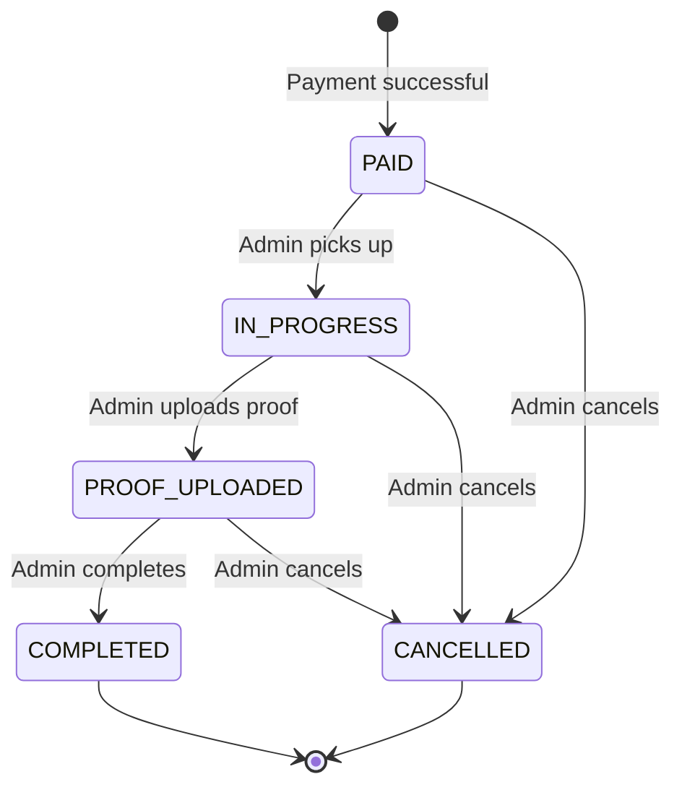
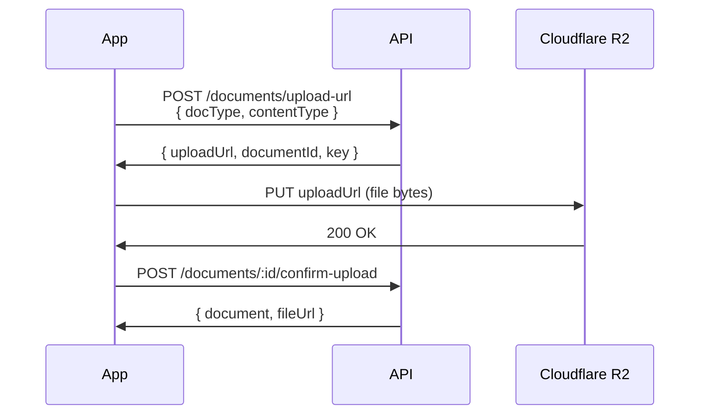

# ShasanSeva Mobile Application — Requirements Document

> **Version:** 1.0 (Draft)
> **Date:** 2026-02-13
> **Status:** Under Discussion
> **Base API URL:** `https://<API_DOMAIN>/api`

---

## Table of Contents

1. [App Overview](#1-app-overview)
2. [User Roles & Access](#2-user-roles--access)
3. [Language / Localization](#3-language--localization)
4. [Screen-by-Screen Specification (User App)](#4-screen-by-screen-specification-user-app)
5. [Screen-by-Screen Specification (Admin App)](#5-screen-by-screen-specification-admin-app)
6. [Data Models Reference](#6-data-models-reference)
7. [API Endpoint Reference](#7-api-endpoint-reference)
8. [Order Lifecycle & Status Flow](#8-order-lifecycle--status-flow)
9. [File Upload Flow](#9-file-upload-flow)
10. [Notification System](#10-notification-system)
11. [Error Handling & Edge Cases](#11-error-handling--edge-cases)
12. [Non-Functional Requirements](#12-non-functional-requirements)

---

## 1. App Overview

### 1.1 What Is ShasanSeva?

A **paid assistance platform** helping users apply for government and private schemes. Users pay upfront for assistance — the platform does NOT auto-apply or guarantee approval.

### 1.2 App Modes

The mobile app serves **two separate user experiences** within one app (or two separate apps — to be decided):

| Mode | Users | Purpose |
|------|-------|---------|
| **User App** | End users (Students, Farmers, Loan Candidates, etc.) | Browse schemes, upload documents, pay, track orders |
| **Admin App** | Admins / Super Admins (internal operators) | Process orders, verify documents, upload proofs, manage schemes/users |

### 1.3 Matching the Web App

The mobile app must mirror the web app's:
- Same input field structures, validations, and enums
- Same API endpoints and response handling
- Same business logic rules (payment-first, document requirements, status flow)
- Same localization (English + Marathi)

---

## 2. User Roles & Access

### 2.1 End User

| Field | Details |
|-------|---------|
| Auth | Phone + Password **or** Google OAuth |
| Phone format | Indian 10-digit starting with 6-9 (`/^[6-9]\d{9}$/`) |
| Password | Min 8 characters |
| Categories | `STUDENT`, `FARMER`, `LOAN_CANDIDATE`, `OTHER` |
| Profile complete | Requires: `name` + `phone` + `category` |

**Can:** Browse schemes, apply (pay + upload docs), track orders, view proofs, manage profile, receive notifications.
**Cannot:** Access admin features, modify paid orders, delete orders.

### 2.2 Admin

| Field | Details |
|-------|---------|
| Roles | `ADMIN`, `SUPER_ADMIN` |
| Auth | Phone + Password only (no Google OAuth for admin in mobile) |
| Created by | Super Admins create admin accounts |

**ADMIN can:** Process orders, verify/reject documents, upload proofs, view users.
**SUPER_ADMIN can (additionally):** Create/edit/deactivate admins, manage all schemes, override order assignments.

### 2.3 Session Management

- JWT-based authentication
- Token stored securely (e.g., Keychain on iOS, EncryptedSharedPreferences on Android)
- Token passed in `Authorization: Bearer <token>` header on every request
- Session duration: 7 days (from `JWT_EXPIRES_IN`)

---

## 3. Language / Localization

### 3.1 Supported Locales

| Code | Language | Usage |
|------|----------|-------|
| `en` | English | Default |
| `mr` | Marathi | Regional |

### 3.2 How Language Switching Works

- **First launch:** User selects language on a dedicated Language Selection screen before login
- **After setup:** Language can be changed anytime via **Settings → Language**
- Selected locale stored **locally** on device (AsyncStorage / SharedPreferences)
- Does NOT require re-login or API call to switch
- Affects **all UI text** — labels, buttons, errors, status messages
- The language selection screen is shown **only on first launch** (before any stored language preference exists)

### 3.3 What Is Translated

| Content | Translation Source |
|---------|-------------------|
| **Static UI text** (buttons, labels, headings, error messages) | Client-side i18n JSON files (bundled with app) |
| **Scheme data** (name, description, eligibility, benefits) | Server-side via `?locale=en` or `?locale=mr` query param |
| **Status labels** (PAID, IN_PROGRESS, etc.) | Client-side i18n mapping |
| **Notification titles/messages** | Server-side (currently English only) |

### 3.4 API Locale Parameter

Scheme-related endpoints accept a `locale` query parameter:
- `GET /api/schemes?locale=mr` → Marathi scheme names/descriptions
- `GET /api/schemes/:slug?locale=mr` → Marathi scheme details
- Default: `en` if no locale param provided

---

## 4. Screen-by-Screen Specification (User App)

---

### 4.1 Language Selection Screen (First Launch Only)

| Aspect | Details |
|--------|--------|
| **Purpose** | Let user choose their preferred language before entering the app |
| **When shown** | Only on first launch (no stored language preference found) |
| **Layout** | Centered app logo + two large language buttons |
| **Options** | |

| Button | Label | Locale code |
|--------|-------|-------------|
| English | "English" | `en` |
| Marathi | "मराठी" | `mr` |

| Aspect | Details |
|--------|--------|
| **On selection** | Store locale in local storage → proceed to Splash Screen logic |
| **Skipped on subsequent launches** | If language preference already stored, skip directly to Splash |
| **No API call** | Purely client-side |

---

### 4.2 Splash Screen

| Aspect | Details |
|--------|---------|
| **Purpose** | App brand intro, auth check |
| **Shows** | App logo, app name "ShasanSeva" (in selected language) |
| **Logic** | 1. Check language preference → if none, go to Language Selection. 2. Check JWT token → validate via `GET /api/auth/me` |
| **If valid token** | Navigate to Home Screen |
| **If no/expired token** | Navigate to Login Screen |
| **Duration** | 1.5–2 seconds max |
| **API** | `GET /api/auth/me` |

---

### 4.3 Login Screen

| Aspect | Details |
|--------|---------|
| **Purpose** | User authentication |
| **Input fields** | |

| Field | Type | Validation | Placeholder |
|-------|------|------------|-------------|
| Phone | Text (numeric keyboard) | Required, 10 digits, starts with 6-9 | "Enter phone number" |
| Password | Text (secure) | Required, min 8 chars | "Enter password" |

| Aspect | Details |
|--------|---------|
| **Primary action** | "Login" button → `POST /api/auth/login` |
| **Secondary actions** | "Don't have an account? Register" link, "Login with Google" button |
| **Google OAuth** | Opens browser/webview → `GET /api/auth/google` → redirects back with token |
| **On success** | Store token, check `profileComplete` → if false go to Complete Profile, else go to Home |
| **On error** | Show inline error: "Invalid phone or password" |
| **API** | `POST /api/auth/login` |
| **Request body** | `{ phone: string, password: string }` |
| **Response** | `{ token, user: { userId, phone, name, email, category, profileComplete }, userType: "USER" }` |

---

### 4.4 Register Screen

| Aspect | Details |
|--------|---------|
| **Purpose** | New user registration |
| **Input fields** | |

| Field | Type | Validation | Required |
|-------|------|------------|----------|
| Phone | Text (numeric keyboard) | 10 digits, starts with 6-9 | ✅ |
| Password | Text (secure) | Min 8 characters | ✅ |
| Name | Text | Min 2 characters | Optional |

| Aspect | Details |
|--------|---------|
| **Primary action** | "Register" button → `POST /api/auth/register` |
| **On success** | Store token → navigate to Complete Profile screen |
| **On phone exists error** | Show: "This phone number is already registered" |
| **API** | `POST /api/auth/register` |
| **Request body** | `{ phone: string, password: string, name?: string }` |
| **Response** | `{ token, user: {...}, userType: "USER" }` |

---

### 4.5 Complete Profile Screen

| Aspect | Details |
|--------|---------|
| **Purpose** | Collect profile info to personalize the experience |
| **When shown** | After login/register if `profileComplete === false` |
| **Input fields** | |

| Field | Type | Validation | Required |
|-------|------|------------|----------|
| Name | Text | Min 2, max 255 chars | ✅ |
| Email | Text (email keyboard) | Valid email format | Optional |
| Category | Dropdown/Selector | One of: `STUDENT`, `FARMER`, `LOAN_CANDIDATE`, `OTHER` | ✅ |
| Address Line 1 | Text | Free text | Optional |
| Address Line 2 | Text | Free text | Optional |
| City | Text | Free text | Optional |
| State | Text | Free text | Optional |
| Pincode | Text (numeric keyboard) | Exactly 6 digits (`/^\d{6}$/`) | Optional |

| Aspect | Details |
|--------|---------|
| **Primary action** | "Save Profile" → `PATCH /api/users/profile` |
| **Secondary action** | **"Skip for now"** link → navigate directly to Home Screen without saving |
| **Profile complete when** | `name` + `phone` + `category` are all set |
| **On save success** | Navigate to Home Screen |
| **On skip** | Navigate to Home Screen. Profile remains incomplete. User can complete later from Profile screen. |
| **API** | `PATCH /api/users/profile` |

---

### 4.6 Home Screen (Scheme Discovery)

| Aspect | Details |
|--------|---------|
| **Purpose** | Browse available schemes |
| **Layout** | Category filter tabs/chips at top + scheme cards grid/list |
| **API** | `GET /api/schemes?locale={locale}&category={category}` |

**Category filter chips:**

| Value | Display (EN) | Display (MR) |
|-------|-------------|-------------|
| *(none / all)* | All | सर्व |
| `STUDENT` | Student | विद्यार्थी |
| `FARMER` | Farmer | शेतकरी |
| `LOAN` | Loan | कर्ज |
| `CERTIFICATE` | Certificates | प्रमाणपत्र |
| `JOBS` | Jobs | नोकरी |
| `HEALTH` | Health | आरोग्य |
| `OTHER` | Other | इतर |

**Scheme card shows:**

| Field | Source |
|-------|--------|
| Scheme name | `name` (translated) |
| Description (truncated ~80 chars) | `description` (translated) |
| Category badge | `category` |
| Service fee | `serviceFee` with ₹ prefix |
| Scheme type badge | `schemeType` (`GOVERNMENT` / `PRIVATE`) |

**On card tap** → Navigate to Scheme Detail screen with `slug`

**Header contains:**
- Notification bell icon with unread badge → `GET /api/notifications`
- Profile avatar → navigate to Profile screen

---

### 4.7 Scheme Detail Screen

| Aspect | Details |
|--------|---------|
| **Purpose** | Show full scheme info + CTA to apply |
| **API** | `GET /api/schemes/:slug?locale={locale}` |
| **URL param** | `slug` (from scheme card tap) |

**Displays:**

| Section | Field | Source |
|---------|-------|--------|
| Header | Scheme name | `name` |
| | Category + Type badges | `category`, `schemeType` |
| | Service fee | `serviceFee` |
| Details | Description | `description` |
| | Eligibility | `eligibility` |
| | Benefits | `benefits` |
| Documents | Required documents list | `requiredDocs[]` array |

**Required docs list item shows:**
- Document label (e.g., "Aadhaar Card")
- Required badge (if `required: true`)
- Optional description

**Primary CTA:** "Apply Now — ₹{serviceFee}" button
- **If not logged in** → navigate to Login
- **If logged in** → navigate to Apply screen (profile completion is NOT required to apply)

---

### 4.8 Apply for Scheme Screen (Order Creation)

> **This is the critical path — consent + payment. Document upload is optional and can be done later.**

| Aspect | Details |
|--------|---------|
| **Purpose** | Review scheme, consent, pay, and optionally upload documents |
| **Prerequisite** | User logged in (profile completion NOT required) |

**Step 1: Scheme Summary**

Show a brief summary of the scheme being applied for:
- Scheme name, category, type
- Service fee
- List of documents that will be needed (informational only, **not blocking**)

**Step 2: Document Upload (Optional)**

| Aspect | Details |
|--------|---------|
| **Heading** | "Upload Documents (Optional)" |
| **Subtext** | "You can upload documents now or later from your order details page." |

For each document in `scheme.requiredDocs[]`:

| Field | Details |
|-------|---------|
| Document label | From `requiredDocs[].label` |
| Status | "Not uploaded" / "Uploaded ✓" |
| Upload button | Opens camera/gallery picker |
| Allowed formats | PDF, JPG, PNG (`image/jpeg`, `image/png`, `application/pdf`) |
| Max file size | 5MB per file |
| Upload flow | 1. `POST /api/documents/upload-url` → 2. `PUT` file to URL → 3. `POST /api/documents/:id/confirm-upload` |

> **All documents are optional at this stage.** The user can skip all uploads and proceed directly to payment.

**Step 3: Consent**

| Element | Details |
|---------|---------|
| Disclaimer text | "This is a paid assistance service. We do not guarantee scheme approval." |
| Consent checkbox | Required before proceeding |
| Terms link | Links to Terms of Service |

**Step 4: Payment**

| Aspect | Details |
|--------|---------|
| Payment gateway | Razorpay |
| Create order | `POST /api/payments/create-order` with `{ schemeId }` |
| Razorpay SDK | Opens Razorpay payment sheet with `{ orderId, razorpayOrderId, amount, currency: "INR" }` |
| On payment success | `POST /api/payments/verify` with `{ razorpayOrderId, razorpayPaymentId, razorpaySignature, orderId }` |
| On payment verified | Navigate to Order Confirmation → then Orders list |
| On payment failure | Show error, allow retry. No order created. |

**API sequence:**
1. *(Optional)* `POST /api/documents/upload-url` (per document uploaded)
2. *(Optional)* `PUT` to pre-signed URL (upload file)
3. *(Optional)* `POST /api/documents/:id/confirm-upload` (per document uploaded)
4. `POST /api/payments/create-order` → `{ schemeId }`
5. Open Razorpay with response data
6. `POST /api/payments/verify` → `{ razorpayOrderId, razorpayPaymentId, razorpaySignature, orderId }`

---

### 4.9 Orders List Screen

| Aspect | Details |
|--------|---------|
| **Purpose** | View all user's orders |
| **API** | `GET /api/orders?page=1&limit=20` |
| **Response format** | `{ data: Order[], pagination: { page, limit, total, totalPages } }` |

**Each order card shows:**

| Field | Source |
|-------|--------|
| Scheme name | `schemeName` |
| Category | `schemeCategory` |
| Amount paid | `paymentAmount` with ₹ prefix |
| Status badge (colored) | `status` |
| Date | `createdAt` formatted as `DD MMM YYYY` |

**Status badge colors:**

| Status | Color | Label (EN) |
|--------|-------|------------|
| `PAID` | Blue | Paid |
| `IN_PROGRESS` | Orange | In Progress |
| `PROOF_UPLOADED` | Purple | Proof Uploaded |
| `COMPLETED` | Green | Completed |
| `CANCELLED` | Red | Cancelled |

**On card tap** → Navigate to Order Detail screen

**Pagination:** Load more on scroll / page buttons

---

### 4.10 Order Detail Screen

| Aspect | Details |
|--------|---------|
| **Purpose** | Full order details with documents and proofs |
| **API** | `GET /api/orders/:id` |

**Displays:**

| Section | Content |
|---------|---------|
| **Order Info** | Scheme name, status badge, amount, order date, payment timestamp |
| **Documents** | List of uploaded documents with status (UPLOADED / VERIFIED / REJECTED) |
| **Rejected docs** | Show rejection reason + re-upload button |
| **Proofs** | List of proofs uploaded by admin (after `PROOF_UPLOADED` status) |

**Document item:**

| Field | Source |
|-------|--------|
| Document type | `docType` |
| Status badge | `status` (UPLOADED/VERIFIED/REJECTED) |
| Rejection reason | `rejectionReason` (if REJECTED) |
| Download link | `GET /api/documents/:id/download-url` |
| Re-upload button | Only visible if status is `REJECTED` |

**Proof item (visible after admin uploads):**

| Field | Source |
|-------|--------|
| Proof type | `proofType` (RECEIPT/SCREENSHOT/REFERENCE_ID/CONFIRMATION/OTHER) |
| Description | `description` |
| Upload date | `uploadedAt` |
| Download/View | `GET /api/proofs/:id/download-url` |

**Proof loading API:** `GET /api/proofs/order/:orderId`

---

### 4.11 Profile Screen

| Aspect | Details |
|--------|---------|
| **Purpose** | View and edit user profile |
| **API (read)** | `GET /api/users/profile` |
| **API (update)** | `PATCH /api/users/profile` |

**Displays / Editable fields:**

| Field | Type | Editable | Validation |
|-------|------|----------|------------|
| Name | Text | ✅ | Min 2, max 255 |
| Phone | Text | ✅ | 10 digits, starts 6-9 |
| Email | Text | ✅ | Valid email or empty |
| Category | Dropdown | ✅ | STUDENT/FARMER/LOAN_CANDIDATE/OTHER |
| Address Line 1 | Text | ✅ | Free text |
| Address Line 2 | Text | ✅ | Free text |
| City | Text | ✅ | Free text |
| State | Text | ✅ | Free text |
| Pincode | Text | ✅ | 6 digits |
| Member since | Text | ❌ (read-only) | `createdAt` |

**Additional actions:**
- **Change Password** → navigates to Change Password screen
- **Settings** → navigates to Settings screen
- **Logout** → `POST /api/auth/logout` → clear token → navigate to Login

---

### 4.12 Settings Screen

| Aspect | Details |
|--------|--------|
| **Purpose** | App preferences including language |

**Settings options:**

| Setting | Type | Details |
|---------|------|---------|
| Language | Selector (EN / MR) | Changes app language. Updates stored locale. All UI text refreshes immediately. |
| App Version | Read-only | Display current app version |

---

### 4.13 Change Password Screen

| Aspect | Details |
|--------|---------|
| **API** | `POST /api/auth/change-password` |

| Field | Type | Validation |
|-------|------|------------|
| Current Password | Text (secure) | Required, min 1 char |
| New Password | Text (secure) | Required, min 8 chars |
| Confirm New Password | Text (secure) | Must match new password (client-side only) |

---

### 4.14 Notifications Screen

| Aspect | Details |
|--------|---------|
| **Purpose** | View all notifications |
| **API** | `GET /api/notifications?limit=50` |
| **Response** | `{ notifications: [...], unreadCount: number }` |

**Each notification shows:**

| Field | Source |
|-------|--------|
| Title | `title` |
| Message | `message` |
| Time | `createdAt` (relative: "2 hours ago") |
| Read status | `read` (unread items highlighted) |

**Actions:**
- Tap notification → `PATCH /api/notifications/:id/read` → navigate to related Order if `relatedOrderId` exists
- "Mark all read" button → `POST /api/notifications/mark-all-read`

**Real-time (optional):** SSE via `GET /api/notifications/stream` for live badge updates

**Notification types received:**

| Type | Trigger |
|------|---------|
| `PAYMENT_SUCCESS` | After successful payment |
| `ORDER_STATUS_CHANGE` | Admin changes order status |
| `DOCUMENT_REJECTED` | Admin rejects a document |
| `PROOF_UPLOADED` | Admin uploads proof for user's order |
| `ORDER_COMPLETED` | Order marked completed |

---

## 5. Screen-by-Screen Specification (Admin App)

---

### 5.1 Admin Login Screen

Same as User Login but:
- No Google OAuth option
- No Register link
- On login, response `userType === "ADMIN"` → route to admin screens
- Same API: `POST /api/auth/login`

---

### 5.2 Admin Dashboard Screen

| Aspect | Details |
|--------|---------|
| **Purpose** | Overview statistics + recent orders |
| **API** | `GET /api/admin/stats` |

**Stats cards displayed:**

| Stat | Source |
|------|--------|
| Total Users | `stats.totalUsers` |
| New Orders (PAID) | `stats.newOrders` |
| In Progress | `stats.inProgress` |
| Completed Today | `stats.completedToday` |

**Recent Orders section:**
- Shows last 5 orders from `GET /api/orders/admin/queue?limit=5`
- Each shows: order ID (truncated), user name, scheme name, status badge, date
- "View All" link → navigates to Admin Orders screen

---

### 5.3 Admin Orders Screen (Order Queue)

| Aspect | Details |
|--------|---------|
| **Purpose** | View and process all orders |
| **API** | `GET /api/orders/admin/queue?page={page}&limit=20&status={status}` |

**Status filter tabs:**

| Tab | Filter value | Shows |
|-----|-------------|-------|
| All | *(no status param)* | All orders |
| Paid | `status=PAID` | New orders to pick up |
| In Progress | `status=IN_PROGRESS` | Orders being worked on |
| Proof Uploaded | `status=PROOF_UPLOADED` | Ready for completion |
| Completed | `status=COMPLETED` | Done |
| Cancelled | `status=CANCELLED` | Cancelled |

**Order row shows:**

| Field | Source |
|-------|--------|
| Order ID (first 8 chars) | `id` |
| User name | `userName` |
| User phone | `userPhone` |
| Scheme name | `schemeName` |
| Amount | `paymentAmount` |
| Status badge | `status` |
| Date | `createdAt` |
| Action button | Depends on status |

**Action buttons:**

| Current Status | Button | API call |
|---------------|--------|----------|
| `PAID` | "Pick Up" | `PATCH /api/orders/:id/status` → `{ status: "IN_PROGRESS" }` |
| `IN_PROGRESS` (assigned to me) | "Upload Proof" | Navigate to Proof Upload screen |
| `PROOF_UPLOADED` | "Complete" | `POST /api/orders/:id/complete` |
| `COMPLETED` / `CANCELLED` | — (no action) | — |

**Pagination:** Previous / Next buttons with page count

---

### 5.4 Admin Order Detail Screen

| Aspect | Details |
|--------|---------|
| **Purpose** | Full order details with document verification + proof management |
| **API** | `GET /api/orders/:id` (same endpoint, admin has full access) |

**Sections:**

**A. Order Information**
- Order ID, status, amount, dates, assigned admin

**B. User Information**
- Name, phone, email, category

**C. Documents (with verification actions)**

For each document:

| Field | Admin Action |
|-------|-------------|
| Document type + file preview | View/Download via `GET /api/documents/:id/download-url` |
| Status | Current status badge |
| **Verify button** | `PATCH /api/documents/:id/verify` with `{ adminNotes?: string }` |
| **Reject button** | `PATCH /api/documents/:id/reject` with `{ rejectionReason: string }` (min 5 chars) |

**D. Proofs Section**
- List existing proofs via `GET /api/proofs/order/:orderId`
- "Upload Proof" button → navigate to Proof Upload screen
- Each proof: type, description, download link

**E. Status Actions**
- Button to advance status (same rules as Orders list)
- Admin notes text input on status change: `{ status, adminNotes?: string }`

---

### 5.5 Proof Upload Screen (Admin)

| Aspect | Details |
|--------|---------|
| **Purpose** | Admin uploads proof of work completion |
| **Prerequisite** | Order must be `IN_PROGRESS` and assigned to current admin |

| Field | Type | Validation |
|-------|------|------------|
| Proof Type | Dropdown | Required. Options: `RECEIPT`, `SCREENSHOT`, `REFERENCE_ID`, `CONFIRMATION`, `OTHER` |
| Description | Text | Optional |
| File | File picker (camera/gallery) | Required. PDF/JPG/PNG, max 5MB |

**Upload flow:**
1. `POST /api/proofs/upload-url` → `{ orderId, proofType, contentType, description? }`
2. `PUT` file to returned `uploadUrl`
3. `POST /api/proofs/:id/confirm` → confirms upload + sets order to `PROOF_UPLOADED`

---

### 5.6 Admin Schemes Screen

| Aspect | Details |
|--------|---------|
| **Purpose** | Manage all schemes |
| **API** | `GET /api/schemes?status=ACTIVE&locale=en` (shows all with admin auth) |

**List shows:**
- Scheme name, category, type, fee, status badge
- Tap → Edit Scheme screen

**Actions:**
- "Create Scheme" FAB → Create Scheme screen
- Filter by status (Active / Inactive)

---

### 5.7 Create / Edit Scheme Screen (Admin)

| Aspect | Details |
|--------|---------|
| **Create API** | `POST /api/schemes` |
| **Edit API (fetch)** | `GET /api/schemes/by-id/:id` |
| **Edit API (save)** | `PATCH /api/schemes/:id` |

**Input fields:**

| Field | Type | Validation | Required |
|-------|------|------------|----------|
| Slug | Text | Min 3, max 255, lowercase alphanumeric + hyphens only (`/^[a-z0-9-]+$/`) | ✅ |
| Category | Dropdown | `STUDENT`/`FARMER`/`LOAN`/`CERTIFICATE`/`JOBS`/`OTHER`/`HEALTH` | ✅ |
| Scheme Type | Dropdown | `GOVERNMENT`/`PRIVATE` | ✅ |
| Service Fee | Number (decimal) | Positive number | ✅ |
| Status | Toggle/Dropdown | `ACTIVE`/`INACTIVE` | ✅ Default: ACTIVE |

**Translation fields (per locale — `en` required, `mr` optional):**

| Field | Type | Required (EN) | Required (MR) |
|-------|------|--------------|--------------|
| Name | Text | ✅ (min 1, max 255) | Optional |
| Description | Multi-line text | Optional | Optional |
| Eligibility | Multi-line text | Optional | Optional |
| Benefits | Multi-line text | Optional | Optional |

**Required Documents (dynamic list):**

Each document entry:

| Field | Type | Required |
|-------|------|----------|
| Type (key) | Text | ✅ (e.g., `AADHAAR`, `PAN`, `INCOME_CERT`) |
| Label (display name) | Text | ✅ (e.g., "Aadhaar Card") |
| Required | Toggle | ✅ Default: true |
| Description | Text | Optional |

Admin can add/remove document entries.

---

### 5.8 Admin Users Screen

| Aspect | Details |
|--------|---------|
| **Purpose** | View registered users |
| **API** | `GET /api/admin/users` |

**List shows:**
- Name, phone, email, category, profile complete status, joined date
- Tap → User Detail (read-only): `GET /api/admin/users/:id`

---

### 5.9 Admin Management Screen (Super Admin Only)

| Aspect | Details |
|--------|---------|
| **Purpose** | Create and manage admin accounts |
| **API (list)** | `GET /api/admin/admins` |
| **API (create)** | `POST /api/admin/admins` |
| **API (update)** | `PATCH /api/admin/admins/:id` |

**Create Admin fields:**

| Field | Type | Validation | Required |
|-------|------|------------|----------|
| Phone | Text (numeric) | 10 digits | ✅ |
| Email | Text (email) | Valid email or empty | Optional |
| Name | Text | Min 2, max 255 | ✅ |
| Role | Dropdown | `ADMIN` / `SUPER_ADMIN`, default: ADMIN | ✅ |
| Password | Text (secure) | Min 8 chars | ✅ |

**Edit Admin fields (same as above minus password being optional)**

**Admin list shows:** name, phone, email, role badge, active status

---

### 5.10 Admin Analytics Screen

| Aspect | Details |
|--------|---------|
| **Purpose** | View current admin's performance stats |
| **API** | `GET /api/admin/my-analytics` |

**Displays:**

| Stat | Field |
|------|-------|
| Total Orders Handled | `totalOrdersHandled` |
| Completed | `ordersCompleted` |
| Cancelled | `ordersCancelled` |
| In Progress | `ordersInProgress` |
| Documents Verified | `documentsVerified` |
| Documents Rejected | `documentsRejected` |
| Avg Completion Time | `avgCompletionTimeHours` |
| Last Active | `lastActiveAt` |

---

## 6. Data Models Reference

### 6.1 User

```
id:               UUID
phone:            string (15 chars, unique)
email:            string (255 chars, unique, optional)
name:             string (255 chars, optional)
category:         "STUDENT" | "FARMER" | "LOAN_CANDIDATE" | "OTHER"
googleId:         string (optional)
address:          { line1?, line2?, city?, state?, pincode? }
savedDocuments:   [{ type, label, fileUrl, fileKey, uploadedAt }]
profileComplete:  boolean
createdAt:        timestamp
updatedAt:        timestamp
```

### 6.2 Order

```
id:               UUID
userId:           UUID → User
schemeId:         UUID → Scheme
status:           "PAID" | "IN_PROGRESS" | "PROOF_UPLOADED" | "COMPLETED" | "CANCELLED"
paymentId:        string (Razorpay payment ID)
razorpayOrderId:  string
paymentAmount:    decimal(10,2)
paymentTimestamp:  timestamp
consentTimestamp:  timestamp
termsVersion:     string
assignedTo:       UUID → Admin (nullable)
adminNotes:       text
createdAt:        timestamp
updatedAt:        timestamp
```

### 6.3 Scheme

```
id:               UUID
name:             string (255, English fallback)
slug:             string (255, unique)
description:      text
category:         "STUDENT" | "FARMER" | "LOAN" | "CERTIFICATE" | "JOBS" | "OTHER" | "HEALTH"
schemeType:       "GOVERNMENT" | "PRIVATE"
eligibility:      text
benefits:         text
requiredDocs:     [{ type, label, required, description? }]
serviceFee:       decimal(10,2)
status:           "ACTIVE" | "INACTIVE"
createdBy:        UUID → Admin
createdAt:        timestamp
updatedAt:        timestamp
```

### 6.4 Document

```
id:               UUID
orderId:          UUID → Order
docType:          string (100 chars)
fileUrl:          string (500 chars)
fileKey:          string (500 chars, R2 key)
status:           "UPLOADED" | "VERIFIED" | "REJECTED" | "RESUBMISSION_REQUIRED"
rejectionReason:  text (nullable)
uploadedAt:       timestamp
verifiedAt:       timestamp (nullable)
verifiedBy:       UUID → Admin (nullable)
```

### 6.5 Proof

```
id:               UUID
orderId:          UUID → Order
fileUrl:          string
fileKey:          string (R2 key)
proofType:        "RECEIPT" | "SCREENSHOT" | "REFERENCE_ID" | "CONFIRMATION" | "OTHER"
description:      text (nullable)
uploadedAt:       timestamp
uploadedBy:       UUID → Admin
```

### 6.6 Notification

```
id:               UUID
recipientId:      UUID
recipientType:    "USER" | "ADMIN"
type:             "PAYMENT_SUCCESS" | "ORDER_STATUS_CHANGE" | "DOCUMENT_REJECTED" | "PROOF_UPLOADED" | "ORDER_COMPLETED" | "NEW_ORDER_ASSIGNED"
title:            string
message:          text
relatedOrderId:   UUID → Order (nullable)
read:             boolean (default: false)
createdAt:        timestamp
```

---

## 7. API Endpoint Reference

### Authentication

| Method | Endpoint | Auth | Purpose |
|--------|----------|------|---------|
| `POST` | `/api/auth/register` | ❌ | Register with phone + password |
| `POST` | `/api/auth/login` | ❌ | Login (users + admins) |
| `POST` | `/api/auth/logout` | ✅ | Invalidate session |
| `GET` | `/api/auth/me` | ✅ | Get current profile |
| `POST` | `/api/auth/change-password` | ✅ | Change password |
| `GET` | `/api/auth/google` | ❌ | Google OAuth redirect |
| `GET` | `/api/auth/google/callback` | ❌ | Google OAuth callback |

### User Profile

| Method | Endpoint | Auth | Purpose |
|--------|----------|------|---------|
| `GET` | `/api/users/profile` | ✅ User | Get full profile |
| `PATCH` | `/api/users/profile` | ✅ User | Update profile fields |

### Schemes

| Method | Endpoint | Auth | Purpose |
|--------|----------|------|---------|
| `GET` | `/api/schemes?locale=&category=&schemeType=&status=&search=` | ❌ | List schemes (public) |
| `GET` | `/api/schemes/:slug?locale=` | ❌ | Scheme detail by slug |
| `GET` | `/api/schemes/by-id/:id` | ✅ Admin | Scheme detail by UUID (for edit) |
| `POST` | `/api/schemes` | ✅ Admin | Create scheme |
| `PATCH` | `/api/schemes/:id` | ✅ Admin | Update scheme |
| `DELETE` | `/api/schemes/:id` | ✅ Admin | Deactivate scheme (soft delete) |

### Orders

| Method | Endpoint | Auth | Purpose |
|--------|----------|------|---------|
| `GET` | `/api/orders?page=&limit=` | ✅ User | User's orders (paginated) |
| `GET` | `/api/orders/:id` | ✅ | Order detail |
| `PATCH` | `/api/orders/:id/status` | ✅ Admin | Update order status |
| `POST` | `/api/orders/:id/complete` | ✅ Admin | Mark order complete |
| `GET` | `/api/orders/admin/queue?page=&limit=&status=` | ✅ Admin | Admin order queue (paginated) |

### Documents

| Method | Endpoint | Auth | Purpose |
|--------|----------|------|---------|
| `POST` | `/api/documents/upload-url` | ✅ | Get pre-signed upload URL |
| `POST` | `/api/documents/:id/confirm-upload` | ✅ | Confirm document uploaded |
| `GET` | `/api/documents/:id/download-url` | ✅ | Get pre-signed download URL |
| `PATCH` | `/api/documents/:id/verify` | ✅ Admin | Verify a document |
| `PATCH` | `/api/documents/:id/reject` | ✅ Admin | Reject a document |
| `GET` | `/api/documents/order/:orderId` | ✅ Admin | All documents for an order |

### Payments

| Method | Endpoint | Auth | Purpose |
|--------|----------|------|---------|
| `POST` | `/api/payments/create-order` | ✅ | Create Razorpay order |
| `POST` | `/api/payments/verify` | ✅ | Verify payment signature |
| `POST` | `/api/payments/webhook` | ❌ | Razorpay webhook (server-to-server) |

### Proofs

| Method | Endpoint | Auth | Purpose |
|--------|----------|------|---------|
| `POST` | `/api/proofs/upload-url` | ✅ Admin | Get proof upload URL |
| `POST` | `/api/proofs/:id/confirm` | ✅ Admin | Confirm proof upload |
| `GET` | `/api/proofs/order/:orderId` | ✅ Admin | All proofs for an order |
| `GET` | `/api/proofs/:id/download-url` | ✅ | Download proof |

### Notifications

| Method | Endpoint | Auth | Purpose |
|--------|----------|------|---------|
| `GET` | `/api/notifications?limit=` | ✅ | Get notifications |
| `PATCH` | `/api/notifications/:id/read` | ✅ | Mark as read |
| `POST` | `/api/notifications/mark-all-read` | ✅ | Mark all as read |
| `GET` | `/api/notifications/stream` | ✅ | SSE real-time updates |

### Admin Management

| Method | Endpoint | Auth | Purpose |
|--------|----------|------|---------|
| `GET` | `/api/admin/stats` | ✅ Admin | Dashboard statistics |
| `GET` | `/api/admin/users` | ✅ Admin | List all users |
| `GET` | `/api/admin/users/:id` | ✅ Admin | User detail |
| `GET` | `/api/admin/my-analytics` | ✅ Admin | My performance stats |
| `GET` | `/api/admin/admins` | ✅ Super | List all admins |
| `POST` | `/api/admin/admins` | ✅ Super | Create admin |
| `PATCH` | `/api/admin/admins/:id` | ✅ Super | Update admin |

---

## 8. Order Lifecycle & Status Flow



**Valid transitions:**

| From | Allowed To |
|------|-----------|
| `PAID` | `IN_PROGRESS`, `CANCELLED` |
| `IN_PROGRESS` | `PROOF_UPLOADED`, `CANCELLED` |
| `PROOF_UPLOADED` | `COMPLETED`, `CANCELLED` |
| `COMPLETED` | *(terminal)* |
| `CANCELLED` | *(terminal)* |

---

## 9. File Upload Flow



**Allowed content types:** `image/jpeg`, `image/png`, `application/pdf`
**Max file size:** 5MB

---

## 10. Notification System

### In-App Notifications
- Fetched via `GET /api/notifications`
- Unread count displayed as badge on bell icon
- Tapping a notification marks it read and navigates to the related order

### Real-Time (Optional)
- SSE endpoint: `GET /api/notifications/stream`
- Sends `{ type: "unread_count", count: N }` every 10 seconds
- Use for live badge count updates

---

## 11. Error Handling & Edge Cases

### API Error Response Format

```json
{
  "success": false,
  "error": {
    "code": "VALIDATION_ERROR",
    "message": "Invalid Indian phone number"
  }
}
```

**Error codes:** `VALIDATION_ERROR`, `UNAUTHORIZED`, `FORBIDDEN`, `NOT_FOUND`, `INTERNAL_ERROR`

### Key Edge Cases

| Scenario | Handling |
|----------|---------|
| Payment fails mid-flow | No order created, documents discarded, show error + retry |
| Token expired (401) | Clear token, redirect to Login |
| Network error | Show retry option, don't lose form state |
| Document upload fails | Allow re-upload for that specific document |
| Admin tries to process order assigned to another | 403 error shown as "This order is assigned to another admin" |
| Profile incomplete + user tries to apply | Block, redirect to Complete Profile |

---

## 12. Non-Functional Requirements

| Requirement | Target |
|-------------|--------|
| Minimum OS | iOS 15+ / Android API 26+ (Android 8) |
| Offline mode | Not required (all features need network) |
| Biometric auth | Nice-to-have (future) |
| Push notifications | Nice-to-have (future, server sends in-app only now) |
| Deep linking | Nice-to-have (future) |
| App size | Target < 25MB |
| API response time | < 2 seconds for all endpoints |
| Image compression | Compress before upload if > 2MB |

---

## 13. Changes from Original DRD

The following changes have been made in this mobile app requirements document compared to the [original web DRD](file:///c:/Users/niles/OneDrive/Desktop/Projects/AbhayaITSolutions-Projects/ShasanSeva/Reuirements.md):

| # | Change | Original DRD | Mobile App Requirement | Rationale |
|---|--------|-------------|----------------------|----------|
| 1 | **Document upload is optional during application** | Documents uploaded **before** payment. Missing documents → cannot proceed. | All document uploads are **optional** at application time. Users can pay first and upload documents later from the Order Detail screen. | Reduces friction — many users (especially rural/semi-urban) may not have all documents ready at the time of applying. Allows them to pay and upload later at their own pace. |
| 2 | **Profile completion is skippable** | Profile must be complete before applying. | Profile completion screen shows a **"Skip for now"** option. Users can browse, apply, and pay without completing their profile first. | Faster onboarding — users can explore the app immediately without being blocked by a mandatory form. Profile can be completed later from the Profile screen. |
| 3 | **Language selection on first launch** | Not specified in DRD (web uses URL-based locale `/en/` or `/mr/`). | Dedicated Language Selection screen on first launch. Language changeable later via Settings. | Mobile-first UX — ensures the entire app is in the user's preferred language from the first screen. Critical for Marathi-speaking users who may not understand English UI. |
| 4 | **Authentication uses password** | Passwordless only (OTP + Google OAuth). No password creation/storage. | Phone + Password login/register, plus Google OAuth. | The existing backend API already implements password-based auth. OTP-based auth can be added as a future enhancement when SMS/WhatsApp OTP services are integrated. |

> **Note:** These changes are intentional deviations to improve mobile UX. They may require minor backend API adjustments (e.g., allowing order creation without documents, making profile fields optional for certain flows).

---

> **This document is a draft for discussion.** All screen designs, UX flows, and features listed above are open for review and modification before development begins.
